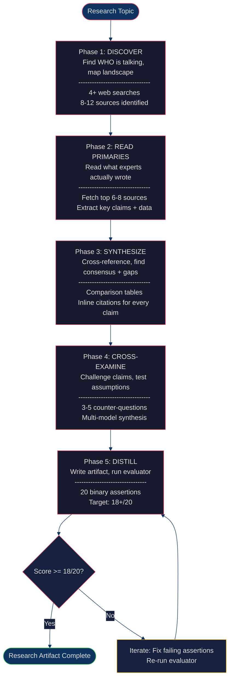
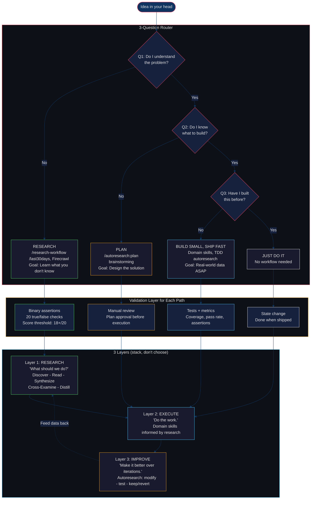

# QuisKaizen Visual Assets

## 5-Phase Research Workflow

The core research pipeline. Each phase builds on the last. The evaluation loop at the end ensures quality — if the artifact scores below 18/20 on binary assertions, iterate until it passes.

## Mental Model: 3-Question Router

The decision framework. Start with an idea, route through three questions, validate each path differently, then flow into the three stacking layers: Research, Execute, Improve.

